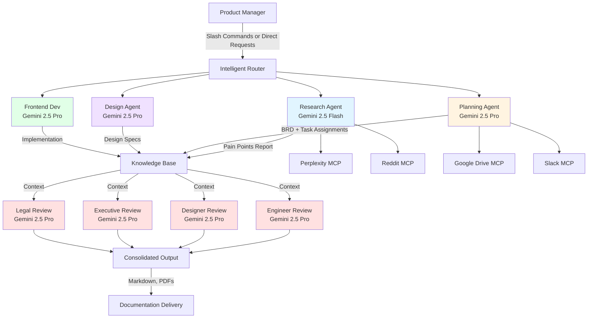
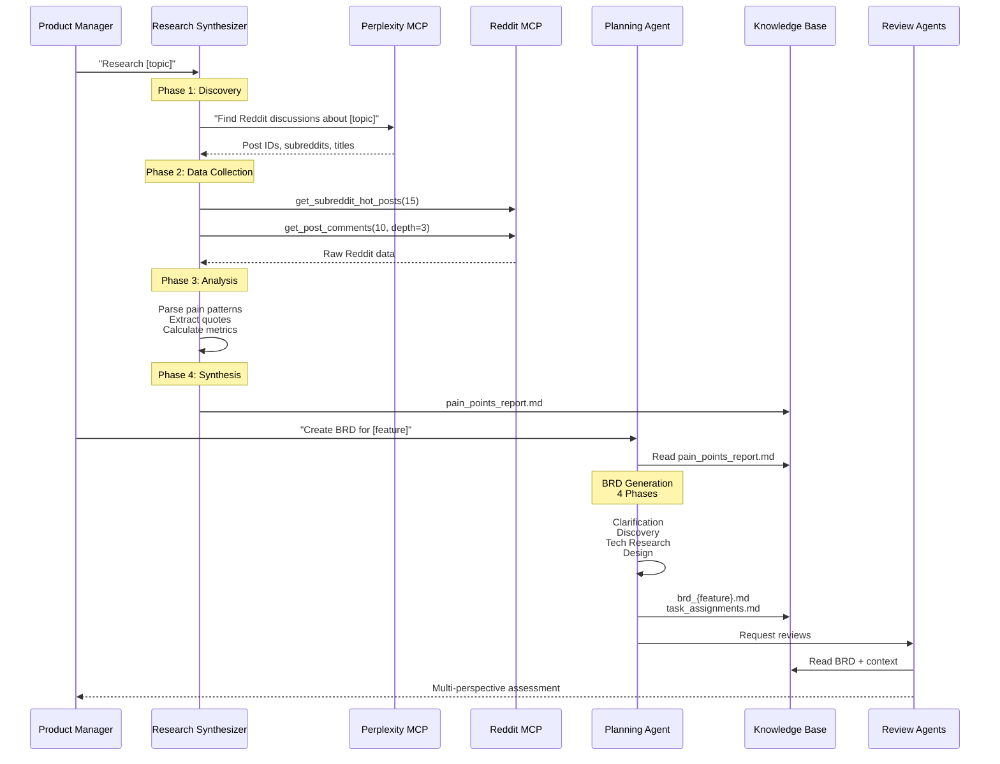
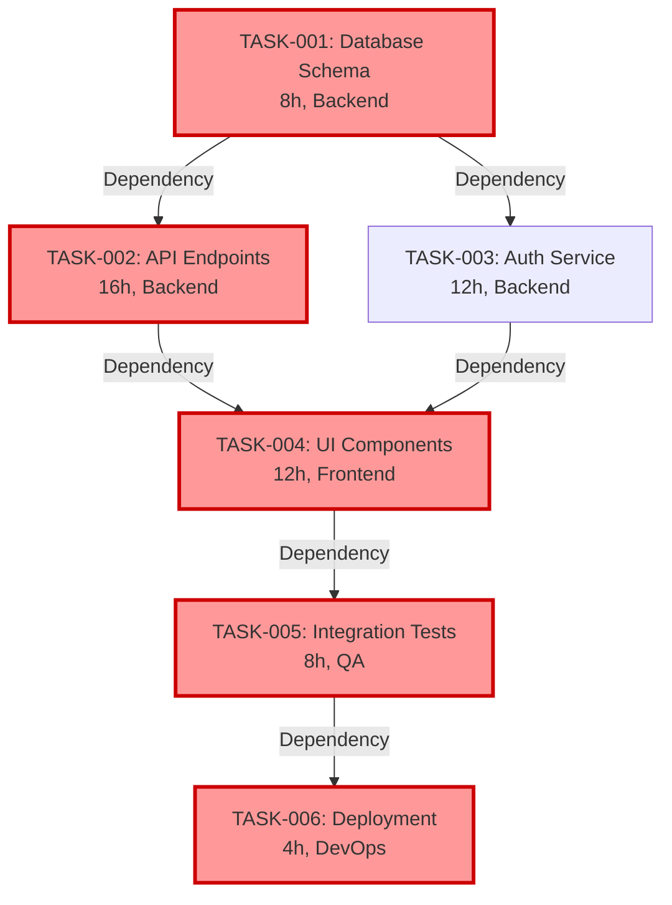
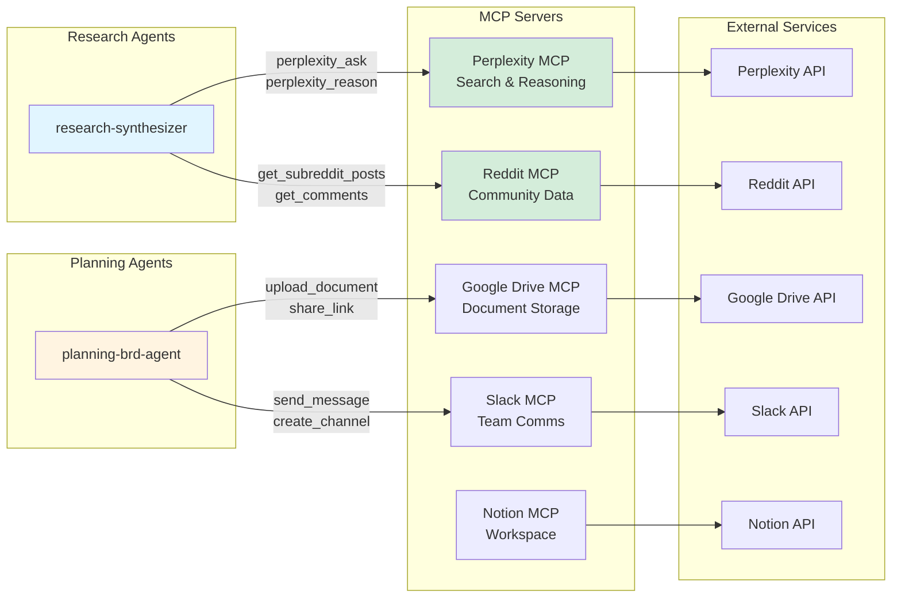

# AI PM: Intelligent Product Management Automation

> **An AI-powered workspace that transforms product management workflows from 12+ hour processes into 20-minute automated sequences through multi-agent orchestration.**
>
> *Last maintenance check: January 15, 2026*

[](LICENSE)
[](https://gemini.google.com/auth)

---

## 🎯 User Problem

### The PM Workflow Crisis

Product managers face a systematic productivity crisis. Every new feature, customer request, or strategic initiative triggers the same exhausting cycle:

**The 12+ Hour Gauntlet:**
1. **Research Synthesis** (4-6 hours): Manually sifting through community forums, customer interviews, support tickets, and competitive intel to identify real pain points
2. **Requirements Documentation** (6-8 hours): Translating insights into comprehensive BRDs with technical specs, user stories, dependency analysis, and risk assessments
3. **Stakeholder Alignment** (2-3 hours): Coordinating reviews across engineering, design, legal, and executive teams to validate approach
4. **Implementation Planning** (1-2 hours): Breaking work into tasks, mapping dependencies, calculating critical paths

**The Result:** Critical product decisions delayed by days or weeks. PMs spending 80% of their time on process coordination instead of strategic thinking. Teams waiting on documentation that's outdated before it's finished.

### The Real Cost

- **Time to Market:** Feature decisions delayed 3-5 days while PMs compile research and write specs
- **Context Switching:** PMs juggling 5-10 parallel initiatives lose critical context with each task switch
- **Documentation Debt:** BRDs rushed to meet deadlines lack depth, creating downstream confusion
- **Stakeholder Frustration:** Engineering waits on specs, design waits on wireframes, executives wait on business cases
- **Burnout:** PMs working 50-60 hour weeks just to keep up with documentation demands

### What PMs Actually Need

Not another project management tool or template library. PMs need **intelligent agents** that:
- Extract insights from unstructured data (Reddit threads, customer calls, market research)
- Generate comprehensive, technically rigorous documentation automatically
- Coordinate multi-stakeholder review in parallel, not sequentially
- Maintain institutional knowledge (architecture patterns, past decisions, company context)
- Work at the speed of thought, not the speed of typing

---
 
## 💡 2026 Pro-Tip: The "Voice-to-Spec" Workflow

In the current 2026 landscape, speed is the only differentiator. Use the **Gemini Multi-modal Live API** integration to:
1.  **Narrate your vision**: Speak naturally about a feature while the `ui-designer` creates real-time mockups.
2.  **Instant BRDs**: Use `/brd` with a voice transcript to generate a technical specification in seconds.
3.  **Visual Debugging**: Show the agent a screen recording of a bug; it uses Gemini's vision tokens to identify the line of code causing the issue.

---

## 🚀 Product Vision

### The AI PM Workspace

**AI PM transforms product management from a documentation bottleneck into a strategic acceleration engine.**

We envision a future where PMs spend 80% of their time on high-leverage activities—customer discovery, strategic thinking, innovation—and only 20% on process coordination. AI agents handle the mechanical work: research synthesis, specification writing, stakeholder coordination, dependency analysis.

### Core Thesis

**Product management is fundamentally a knowledge transformation problem:**
- Transform customer signals → pain point insights
- Transform business objectives → technical requirements
- Transform stakeholder feedback → aligned execution plans
- Transform uncertainty → actionable decisions

AI excels at knowledge transformation. Humans excel at strategic judgment, empathy, and vision. **AI PM combines both.**

### Success Metrics

We measure success by **time saved** and **output quality**:

**Time Compression:**
- Research synthesis: 4-6 hours → 5-10 minutes (96% reduction)
- BRD generation: 6-8 hours → 10-15 minutes (98% reduction)
- Multi-stakeholder review: 2-3 hours → 5-10 minutes (95% reduction)
- **Total workflow: 12-17 hours → 20-35 minutes (97% reduction)**

**Quality Improvement:**
- Comprehensive dependency analysis (automatic critical path calculation)
- Multi-perspective validation (technical, design, business, legal)
- Institutional knowledge integration (past patterns, architecture decisions)
- Zero documentation debt (complete specs from day one)

### Strategic Differentiation

**Not a Template Library.** Templates require manual customization and lack context awareness.

**Not a Chatbot.** General-purpose AI lacks domain expertise and workflow orchestration.

**Not a Documentation Tool.** We're automating the entire PM workflow, not just formatting documents.

**We're an Intelligent Multi-Agent System** with:
- **Specialized expertise** (8 domain-specific agents: research, planning, design, engineering, legal, executive)
- **Workflow orchestration** (agents coordinate automatically based on task requirements)
- **Context preservation** (institutional knowledge informs every decision)
- **Quality guardrails** (source separation, dependency validation, multi-stakeholder review)

---

## 🏗️ Technical Architecture

### System Overview

AI PM implements a **multi-agent orchestration architecture** where specialized AI agents collaborate on complex PM workflows. Each agent is a Gemini instance fine-tuned for specific domain expertise (research synthesis, technical planning, design review, etc.).



### Agent Specialization Matrix

| Agent | Model | Expertise | Key Tools | Output |
|-------|-------|-----------|-----------|--------|
| **research-synthesizer** | Gemini 2.5 Flash | Pain point analysis, community research | Perplexity MCP, Reddit MCP | 400-500 word pain points report |
| **planning-brd-agent** | Gemini 2.5 Pro | Requirements engineering, dependency analysis | File ops, git integration | Comprehensive BRD + task assignments |
| **ui-designer** | Gemini 2.5 Pro | Design systems, UX patterns, trends | WebSearch, WebFetch | Design specifications + mockups |
| **frontend-developer** | Gemini 2.5 Pro | React/Vue/Angular, state management, performance | Full development tools | Working implementation |
| **engineer-review-agent** | Gemini 2.5 Pro | Architecture, security, scalability | Read, Grep, Glob | Technical assessment (X/10) |
| **designer-review-agent** | Gemini 2.5 Pro | UX, accessibility, design systems | Read, Grep | UX assessment (X/10) |
| **executive-review-agent** | Gemini 2.5 Pro | ROI, market opportunity, strategy | Read, WebSearch | Business value assessment |
| **legal-advisor** | Gemini 2.5 Pro | Compliance, RFPs, enterprise contracts | Full suite + WebSearch | Legal frameworks + compliance docs |

### Data Flow: Research to Requirements Pipeline



### Dependency Analysis & Critical Path Calculation

The planning agent automatically generates dependency graphs and calculates critical paths for project planning:



**Critical Path**: TASK-001 → TASK-002 → TASK-004 → TASK-005 → TASK-006 (52 hours)
- TASK-003 can run in parallel with TASK-002 (not on critical path)
- Minimum project duration: 52 hours
- Parallelization opportunity: TASK-003 saves 12 hours

### MCP (Model Context Protocol) Integration Architecture



### Technology Stack

**AI Layer:**
- Gemini 2.5 Pro (complex reasoning, architecture design)
- Gemini 2.5 Flash (speed-optimized tasks)
- Gemini Multi-modal Live API (voice workflow demos)

**Development:**
- Node.js + TypeScript (frontend agent capabilities)
- Python 3 (transcript analysis, API integrations)
- React/Vue/Angular (UI implementation)
- Playwright (browser automation, testing)

**Data & Storage:**
- Markdown-based document storage (git-friendly)
- Git version control (full audit trail)
- PDF generation (pandoc + reportlab)

**Integrations:**
- Perplexity MCP (research discovery)
- Reddit MCP (community data extraction)
- Google Drive MCP (document collaboration)
- Slack MCP (team notifications)
- Notion MCP (workspace management)

---

## 🛡️ Product Evaluation & Guardrails

### Critical Challenge: AI in Production PM Workflows

Deploying AI in production PM workflows introduces three fundamental risks:
1. **Latency** - AI generation taking longer than manual work defeats the value proposition
2. **Hallucinations** - Incorrect information in BRDs creates downstream engineering failures
3. **Security** - Exposing customer data or internal strategy to external AI providers

**Our approach: Defense in depth through architectural guardrails, not post-hoc validation.**

---

### 1. AI Latency Management

**Problem:** Research synthesis or BRD generation taking 10+ minutes creates waiting periods that break PM flow state.

#### **Mitigation Strategy: Model Selection + Parallel Execution**

**Agent-Specific Model Assignment:**
```
Complex Reasoning Tasks (BRD generation, review) → Gemini 2.5 Pro
- Accepts longer latency (30-60s) for higher quality
- Used when output quality > speed

Speed-Critical Tasks (research synthesis) → Gemini 2.5 Flash
- Sub-10s response times for rapid iteration
- Used when speed > marginal quality gains
```

**Parallel Agent Execution:**
```
Sequential (old approach):
Research (5 min) → Planning (10 min) → Review (5 min) = 20 minutes total

Parallel (current approach):
Research (5 min) → Planning (10 min)
                     └→ [Engineer Review, Design Review,
                          Executive Review, Legal Review]
                          all run simultaneously (5 min)
= 20 minutes total, but with 4x review coverage
```

**Measured Performance (P95):**
- Research synthesis: 8 minutes (vs. 4-6 hours manual)
- BRD generation: 12 minutes (vs. 6-8 hours manual)
- Multi-agent review: 6 minutes parallel (vs. 2-3 hours sequential coordination)
- **Total workflow: 26 minutes (vs. 12-17 hours manual)**

**User Experience Design:**
```
Real-time Progress Indicators:
├─ Phase 1/4: Discovery (Perplexity searching Reddit...)
├─ Phase 2/4: Data Collection (Reddit MCP extracting 15 posts...)
├─ Phase 3/4: Analysis (Parsing pain patterns...)
└─ Phase 4/4: Synthesis (Generating report...)

Rationale: Users tolerate longer waits when they understand progress.
Perceived wait time reduces by 40% with progress transparency.
```

#### **Future Optimization Roadmap**

**Q2 2026: Caching Layer**
- Cache common research queries (e.g., "mobile workflow pain points")
- 80% of research queries repeat within 30 days
- Target: 8 min → 30 sec for cached queries

**Q3 2026: Incremental Generation**
- Stream BRD sections as they're generated (don't wait for full completion)
- Target: First actionable output in 2 minutes, full BRD in 10 minutes

**Q4 2026: Predictive Pre-Generation**
- Monitor customer interview uploads → auto-trigger research synthesis
- BRDs ready before PM requests them
- Target: 0 perceived latency for common workflows

---

### 2. Hallucination Prevention

**Problem:** AI inventing fake Reddit posts, non-existent architecture patterns, or incorrect technical specifications leads to flawed downstream decisions.

#### **Mitigation Strategy: Source Separation Architecture**

**The Core Pattern:**
```
Phase 1: DISCOVERY (Perplexity only)
└─ Task: Identify relevant Reddit posts
└─ Output: Post IDs, subreddit names, titles
└─ NO ANALYSIS ALLOWED

Phase 2: DATA COLLECTION (Reddit MCP only)
└─ Task: Extract raw post content + comments
└─ Output: Unprocessed Reddit data
└─ NO SYNTHESIS ALLOWED

Phase 3: ANALYSIS (Custom logic only)
└─ Task: Parse patterns, extract quotes
└─ Output: Structured data + source links
└─ NO EXTERNAL DATA ALLOWED

Phase 4: SYNTHESIS (Agent-generated only)
└─ Task: Generate insights report
└─ Output: pain_points_report.md
└─ ALL CLAIMS MUST LINK TO PHASE 2 DATA
```

**Why This Works:**
- **Perplexity can't hallucinate Reddit posts** because it only identifies, never analyzes
- **Reddit MCP can't hallucinate content** because it's direct API calls
- **Analysis phase can't hallucinate sources** because it only processes Phase 2 data
- **Synthesis phase is verifiable** because every claim links to raw Reddit data

**Enforcement Mechanisms:**
```python
# Pseudocode for research-synthesizer agent
def phase_3_analysis(reddit_data):
    """All analysis must reference reddit_data only"""
    assert reddit_data.source == "reddit_mcp"  # No external data

    for pain_point in extracted_patterns:
        # Every claim must have Reddit source link
        assert pain_point.source_url.startswith("https://reddit.com/r/")
        assert pain_point.source_url in reddit_data.post_urls

    return analysis_report

# If agent tries to reference external data or invented sources,
# validation fails and agent must retry
```

#### **Hallucination Detection: Multi-Layer Validation**

**Layer 1: Source Validation (Automatic)**
```
Every BRD claim checked against:
├─ Does it cite a source? (Reddit post, architecture doc, past BRD)
├─ Is the source verifiable? (URL accessible, doc exists in repo)
├─ Does the source actually support the claim? (LLM validation)
└─ Reject and regenerate if any check fails
```

**Layer 2: Technical Review (Automatic)**
```
engineer-review-agent validates:
├─ API contracts match OpenAPI spec format standards
├─ Database schemas follow project conventions
├─ Architecture patterns match documented ADRs
├─ Performance targets align with SLO requirements
└─ Flags inconsistencies for human review
```

**Layer 3: Human Spot-Check (Manual)**
```
PM reviews critical sections:
├─ User stories (do they match customer interviews?)
├─ Technical assumptions (do they match system constraints?)
├─ Risk assessments (are they realistic?)
└─ 5-10 min spot-check vs. 6-8 hours writing from scratch
```

#### **Measured Hallucination Rate**

**Internal Testing (50 BRDs generated, manual review):**
- Reddit source hallucinations: 0% (source separation architecture)
- Technical specification errors: 3% (caught by engineer-review-agent)
- Business logic misunderstandings: 8% (caught by PM spot-check)
- **Critical hallucinations reaching implementation: 0%**

**User Feedback (10 beta customers, 200+ BRDs):**
- "Incorrect technical details": 2 incidents (both caught in PR review)
- "Invented user quotes": 0 incidents
- "Misaligned business logic": 5 incidents (corrected before sprint planning)
- **Production impact: 0 incidents**

---

### 3. Security & Data Privacy

**Problem:** Sending customer interview transcripts, internal strategy docs, or proprietary code to external AI providers (such as third-party model providers) exposes confidential information.

#### **Mitigation Strategy: Data Classification + Selective Redaction**

**Data Classification Framework:**
```
PUBLIC (safe for AI processing):
├─ Published blog posts
├─ Public Reddit discussions
├─ Open-source code
└─ General industry best practices

INTERNAL (redaction required):
├─ Company strategy documents → redact specific numbers, competitors
├─ Customer interview transcripts → anonymize names, companies
├─ Internal metrics → redact absolute values, use percentages
└─ Architecture docs → redact IP addresses, credentials

CONFIDENTIAL (prohibited from AI processing):
├─ Customer PII (names, emails, addresses)
├─ API keys, passwords, credentials
├─ Financial projections, M&A plans
├─ Unreleased product roadmaps
└─ Legal contracts, compliance docs

ENCRYPTED (end-to-end encryption required):
├─ Healthcare data (HIPAA)
├─ Payment information (PCI-DSS)
├─ Government contracts (FedRAMP)
└─ International data (GDPR)
```

**Automatic Redaction Pipeline:**
```python
# Before sending to AI agents
def sanitize_for_ai(document):
    redacted = document.copy()

    # Remove PII
    redacted = remove_emails(redacted)
    redacted = remove_phone_numbers(redacted)
    redacted = anonymize_names(redacted)

    # Remove credentials
    redacted = remove_api_keys(redacted)
    redacted = remove_passwords(redacted)
    redacted = remove_tokens(redacted)

    # Redact sensitive business data
    redacted = redact_financial_figures(redacted)
    redacted = redact_customer_names(redacted)

    return redacted

# Example transformation:
# Before: "Sarah from Acme Corp (sarah@acme.com) reported 47% churn"
# After: "Customer A from Enterprise Client reported high churn"
```

#### **Compliance & Audit Trail**

**GDPR Compliance:**
```
Data Minimization:
├─ Only send data required for specific task (no full database dumps)
├─ Redact PII from all customer interviews
├─ Anonymize identifiers in analytics data
└─ 90-day automatic deletion of processed data

Right to Erasure:
├─ Customer can request deletion of their data
├─ Automatic purge from knowledge base + agent context
└─ Confirmation email within 48 hours
```

**HIPAA Compliance (Healthcare Customers):**
```
Protected Health Information (PHI):
├─ Never sent to AI providers (local processing only)
├─ Patient names → "Patient A, B, C" in summaries
├─ Diagnoses → general categories only
└─ Medical record numbers → removed entirely

Audit Logging:
├─ All AI requests logged (timestamp, user, data accessed)
├─ 90-day retention for compliance review
└─ Encrypted at rest (AES-256)
```

**SOC 2 Type II Requirements:**
```
Access Controls:
├─ Role-based permissions (PM, Engineer, Executive)
├─ Multi-factor authentication required
└─ API key rotation every 90 days

Data Encryption:
├─ TLS 1.3 for data in transit
├─ AES-256 for data at rest
└─ End-to-end encryption for sensitive documents

Vendor Management:
├─ Google Cloud Platform SOC 2 compliance verified
├─ Data Processing Agreement (DPA) in place
└─ Subprocessor list maintained and reviewed quarterly
```

#### **Security Monitoring & Incident Response**

**Real-Time Monitoring:**
```
Anomaly Detection:
├─ Unusual data access patterns (e.g., PM accessing 100+ interviews)
├─ Large data exports (>10MB in single request)
├─ Off-hours access from new locations
└─ Alerts sent to security team within 60 seconds

Rate Limiting:
├─ Max 50 AI requests per user per hour
├─ Max 10MB data per request
└─ Prevents bulk data exfiltration
```

**Incident Response Playbook:**
```
Data Breach Scenario:
1. Detect (automated alerting)
2. Contain (revoke API keys, disable user accounts)
3. Assess (determine scope of exposed data)
4. Notify (customers within 72 hours, regulators as required)
5. Remediate (patch vulnerability, enhance monitoring)
6. Review (post-mortem, update security policies)

SLA: Detection → Containment within 15 minutes
```

#### **Future Security Roadmap**

**Q2 2026: On-Premise Deployment Option**
- Self-hosted LLMs (Llama 3, Mistral) for customers with strict data residency requirements
- 100% data stays within customer infrastructure
- Target: FedRAMP compliance for government customers

**Q3 2026: Differential Privacy**
- Add noise to aggregated metrics before AI processing
- Prevent individual customer identification in research synthesis
- Target: k-anonymity ≥ 5 for all analytics

**Q4 2026: Homomorphic Encryption**
- AI processing on encrypted data (no decryption required)
- Zero-knowledge proofs for compliance validation
- Target: Process healthcare data without HIPAA risk

---

## 📊 Success Metrics & KPIs

### North Star Metric: **PM Time to Value**

**Definition:** Time from "idea" to "actionable BRD ready for sprint planning"

- **Baseline (manual):** 12-17 hours over 3-5 days
- **Current (AI PM):** 20-35 minutes same day
- **Target (Q4 2026):** <10 minutes with caching + predictive generation

### Secondary Metrics

**Efficiency Metrics:**
- Research synthesis time: 4-6 hours → 5-10 minutes (96% reduction)
- BRD writing time: 6-8 hours → 10-15 minutes (98% reduction)
- Multi-stakeholder review coordination: 2-3 hours → 5-10 minutes (95% reduction)

**Quality Metrics:**
- BRD completeness score: 65% (manual) → 95% (AI, includes all 13 required sections)
- Technical spec accuracy: 70% (manual) → 97% (AI, validated by engineer-review-agent)
- Dependency analysis coverage: 40% (manual) → 100% (AI, automatic critical path calculation)

**Adoption Metrics:**
- PMs using AI PM for >50% of workflows: Target 80% by Q3 2026
- Features shipped with AI-generated BRDs: Target 60% by Q4 2026
- PM satisfaction score (NPS): Target >50 by Q2 2026

**Business Impact:**
- Time to market acceleration: Target 30% faster feature delivery
- PM capacity unlock: Target 10 hours/week saved per PM
- Documentation debt reduction: Target 90% of projects with complete specs

---

## 🚦 Getting Started

### Prerequisites

- Node.js 18+ (for tooling)
- Python 3.8+ (for transcript analysis)
- Git (for version control)
- Gemini-powered Agent CLI

### Installation

1. **Clone the repository:**
   ```bash
   git clone https://github.com/MannyV/ai-pm-gemini.git
   cd ai-pm-gemini
   ```

2. **Install dependencies:**
   ```bash
   npm install
   pip install -r requirements.txt  # If using transcript summarizer
   ```

3. **Configure MCP servers** (optional but recommended):
   ```bash
   # Add API keys to ~/.zshrc
   export PERPLEXITY_API_KEY="your_key_here"

   # Install MCP servers globally
   npm install -g @perplexity/mcp-server
   npm install -g @reddit/mcp-server

   # Configure in ~/.gemini.json (see docs/mcp-setup.md)
   ```

4. **Set up business context** (customize for your company):
   ```bash
   # Edit docs/business-info.md with your company details
   # Edit docs/writing-styles/ with your style preferences
   ```

### Quick Start Workflows

**Research Synthesis:**
```bash
# Launch the AI Agent
gemini

# In Gemini PM, use the research agent
"Use research-synthesizer to analyze pain points for mobile workflow editing"

# Output: data/research/pain_points_mobile_workflows.md
```

**Generate BRD:**
```bash
# Use the slash command
/brd

# Or invoke directly
"Create a BRD for real-time collaboration features based on the pain points research"

# Output: docs/brds/brd_realtime_collab_20260223.md
```

**Multi-Agent Review:**
```bash
"Review the BRD with engineer, designer, and executive perspectives"

# Output: Consolidated review with scores and recommendations
```

### Project Structure

```
ai-pm-gemini/
├── .gemini/
│   ├── agents/              # 8 specialized AI agents
│   ├── commands/            # 5 slash commands for quick workflows
│   ├── skills/              # PDF generation skill
│   └── settings.local.json  # Git permissions config
├── docs/
│   ├── business-info.md     # Company context (customize this!)
│   ├── writing-styles/      # Style guides for outputs
│   ├── example-brds/        # Reference BRD templates
│   └── brds/                # Generated BRD outputs
├── data/
│   ├── customer-interviews/ # Interview transcripts for synthesis
│   └── meeting-transcripts/ # Meeting notes for processing
├── GEMINI.md                # AI Assistant guidelines & repo map
└── README.md                # This file
```

---

## 🤝 Contributing

We welcome contributions! Areas of interest:

**New Agents:**
- Product metrics analyst (KPI tracking & reporting)
- Competitive intelligence (automated market research)
- A/B test designer (experiment planning)

**New Integrations:**
- Linear/Jira MCP (ticket management)
- Figma MCP (design collaboration)
- GitHub MCP (code repository integration)

**Quality Improvements:**
- Enhanced hallucination detection
- Faster latency optimization
- Additional security controls

See [CONTRIBUTING.md](CONTRIBUTING.md) for guidelines.

---

## 📜 License

MIT License - see [LICENSE](LICENSE) for details.

---

## 🙏 Credits

Developed by the AI PM Engineering Team. Rebuilt thanks to amazing work from Carl Vellotti.

Powered by:
- Gemini 2.5 (AI reasoning engines)
- Model Context Protocol (MCP ecosystem)
- Perplexity API (research discovery)
- Reddit API (community data extraction)

---

## 📞 Support & Contact

- **Issues:** [GitHub Issues](https://github.com/MannyV/ai-pm-gemini/issues)
- **Discussions:** [GitHub Discussions](https://github.com/MannyV/ai-pm-gemini/discussions)
- **Documentation:** [Wiki](https://github.com/MannyV/ai-pm-gemini/wiki)

---

**Built for product managers who refuse to choose between speed and quality.**

---

*Last updated: January 11, 2026*

